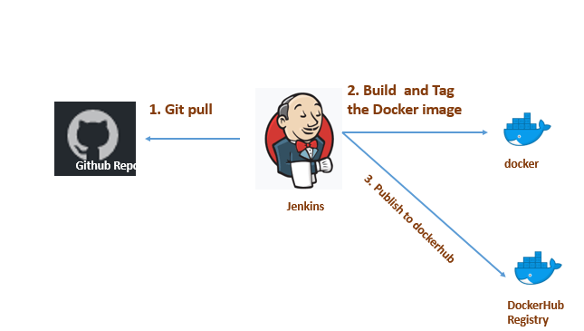

# CI-CD-pipeline
## What it does ? 
This is continuous Integration & deployment pipeline of a springboot app  using jenkins docker and docker hub
It basically checkout code from the Github repository , build the project(maven) , build Docker image and push it to Dockerhub as it is shematic below:

## What I learned ? 

<ul>
<li>Continous Integration && Continuous Deployment</li>
<li>Scripted pipeline in jenkins </li>
<li>Scheduling jobs in jenkins </li>
<li> Managing Artifact repository </li>
</ul>

## How to run ? 
Create a pipeline job in jenkins and try to make the same with your own configuration.
